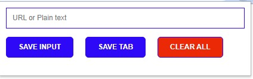

# LEADS TRACKER CHROME EXTENSION

> This project is to demonstrate my knowledge in CSS, HTML and Vanilla JavaScript.

Leads Tracker can be used to save URL from any website.
Build a list of targeted leads to grow your business from any website. For sites with great leads potential as LinkedIn, Leads Tracker can be a tool to save the URL for 1st, 2nd and 3rd level LinkedIn connections. 

Just visit any URL you wish to save, click on ‘save tab’ button and the URL of your current tab is saved. You can also add a description of your URL using the ‘save input’ button.
  
What you can do with this app:
-	Fetch and save URL from any site.
-	100% of the URL are saved on the Leads Tracker.

With Lead Tracker, you don’t have to worry about keeping track of important links.

## Built With

- HTML
- CSS
- JavaScript

## Live Demo

[Live Demo Link](https://kingsleyibe.github.io/LeadsTrackerChromeExtension/)

## Download and Install Extension

[Chrome Web store Link](https://chrome.google.com/webstore/detail/leads-tracker/ocokmojbnnoapdbobddbcbcbegolglfh)

## Author

- GitHub: [@githubhandle](https://github.com/kingsleyibe)
- Twitter: [@twitterhandle](https://twitter.com/ibekingsley2)
- LinkedIn: [LinkedIn](https://www.linkedin.com/in/kingsley-ibe-5669a5134)

## 🤝 Contributing

Contributions, issues, and feature requests are welcome!

Feel free to check the [issues page](../../issues/).

## Show your support

Give a ⭐️ if you like this project! and don't forget to give a review.

## 📝 License

This project is [MIT](./MIT.md) licensed.